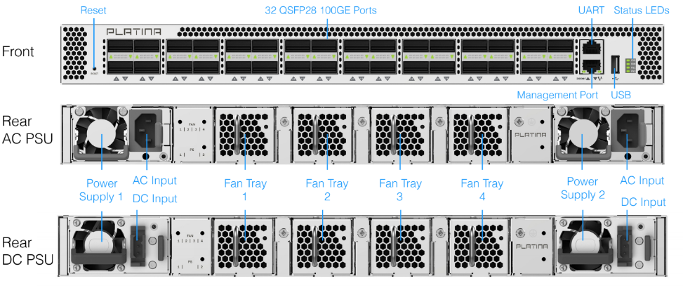
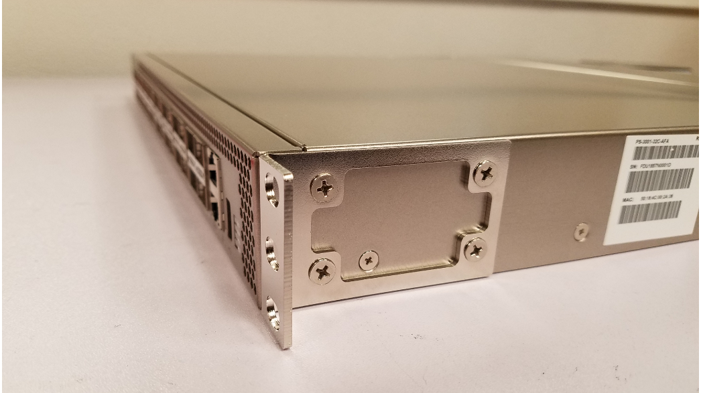
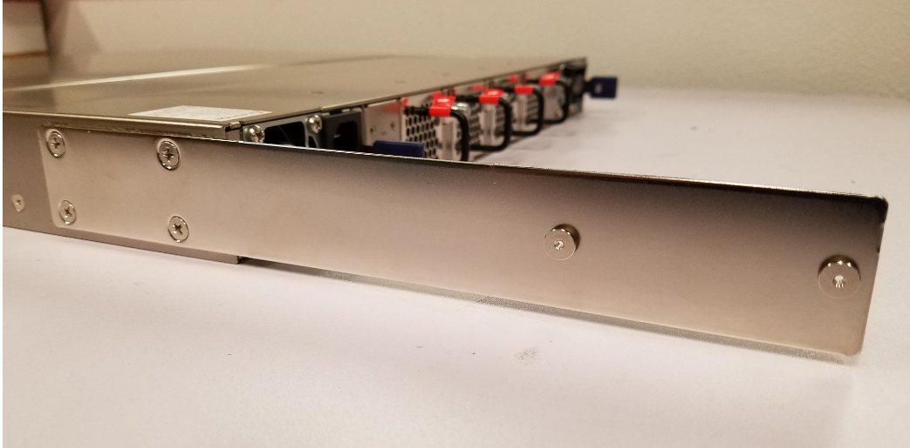

<a name="contents"/>

# Table of Contents

1. [ Table of Contents](#tableofcontents)
1. [ Installation](#installation)
   1. [ Unpacking Platina Edge Device](#unpackingplatinaedgedevice)
   1. [ Rack-mounting Platina Edge Device](#rackmountingplatinaedgedevice)
1. [ Administration](#administration)
   1. [ Quick Start Guide](#quickstartguide)
   1. [ General Architecture](#generalarchitecture)
      1. [ BMC Processor](#bmcprocessor)
      1. [ Intel Processor](#intelprocessor)
      1. [ Linux](#linux)
      1. [ Platina GOES Service](#platinagoesservice)
   1. [ Admin Privilege](#adminprivilege)
   1. [ Redis Database/Interface](#redisdatabaseinterface)
   1. [ QSFP28 Ports](#qsfp28ports)
   1. [ Set Media Type and Speed](#setmediatypeandspeed)
   1. [ Persistent Configuration](#persistentconfiguration)
   1. [ BGP](#bgp)
   1. [ Appendix 1: Redis Fields Guide](#appendix1redisfieldsguide)
      1. [ Fields that can be set in Platina’s Redis:](#fieldsthatcanbesetinplatinasredis)
      1. [ Stats Counter Update Interval](#statscounterupdateinterval)
      1. [ Read-only Redis Fields](#readonlyredisfields)
      1. [ Packages](#packages)
      1. [ Physical link state (as reported by switch ASIC)](#physicallinkstateasreportedbyswitchasic)
      1. [ Linux Packet/Byte counters](#linuxpacketbytecounters)
      1. [ Port Counters](#portcounters)
      1. [ Interface MMU Counters](#interfacemmucounters)
      1. [ Interface Pipe Counters](#interfacepipecounters)
      1. [ fe1 counters](#fe1counters)
      1. [ Eth0 stats](#eth0stats)
      1. [ EEPROM contents](#eepromcontents)
   1. [ Appendix 2: BMC Redis](#appendix2bmcredis)
      1. [ Connecting via IPv4](#connectingviaipv4)
      1. [ Connecting via IPv6 Link Local](#connectingviaipv6linklocal)
      1. [ Notable BMC Redis Fields](#notablebmcredisfields)
      1. [ PSU Information](#psuinformation)
      1. [ Power Monitor Information](#powermonitorinformation)
1. [ Software and Firmware Updates](#softwareandfirmwareupdates)
      1. [ Upgrading Coreboot](#upgradingcoreboot)
      1. [ Upgrading Linux Kernel](#upgradinglinuxkernel)
      1. [ Upgrading GOES](#upgradinggoes)
      1. [ Upgrading Coreboot, Linux Kernel, and GOES in one command](#upgradingcorebootlinuxkernelandgoesinonecommand)
      1. [ Updating the BMC Firmware](#updatingthebmcfirmware)
      1. [ Additional Information](#additionalinformation)
         1. [ Download the flash ROM and Coreboot images](#downloadtheflashromandcorebootimages)
         1. [ Getting to the BMC Console](#gettingtothebmcconsole)
1. [ Support](#support)


<a name="installation"/>

# Installation

## Unpacking Platina Edge Device

The shipped package includes the following items:
 * 1 Platina Appliance Head Device with model number matching the packing slip
 * 2 AC power cords
 * 1 console cable with RJ45 to DB9 adapter for use when connecting the console direct to a laptop or other host.
 * 1 rack mount ear kit
 * 1 footpad kit



## Rack-mounting Platina Edge Device

This procedure is used to rack mount the Platina Appliance Head Device to a rack. It requires two people. Refer to the pictures below for the procedure. If Platina Appliance Head Device will be free-standing on a bench, then this procedure can be skipped and the footpad kit can be installed for bench use.



1. Install the front rack mount ear kit, as shown in the first picture above.
2. Install the rear mount kit, as shown in second picture above if the rack is a 4-post rack. These brackets are not required if the rack is a 2-post rack.
3. Install the device in the rack. One person should lift the device into the rack to align the front rack brackets with the marked holes. A second person should secure the device in the rack using four rack-mounting screws (not provided).
4. If using the rear brackets, slide in the second portion and adjust until holes are align. Secure in place using rack-mounting screws (not provided).
5. Connect AC power to Platina Appliance Head Device.
6. Verify basic switch operation by checking the status of the switch status LEDs. When operating normally the LEDs should be green.



<a name="administration"/>

# Administration

<a name="quickstartguide"/>

## Quick Start Guide

Please refer to the quick start guide included with the unit for
hardware package/unpackage instructions, MAC addresses, port labeling,
field replaceable unit labeling, and other general instructions.

<a name="generalarchitecture"/>

## General Architecture

The PSW-3001-32C contains a 32x100GE switch with hardware forwarding up to
3.2Tbps via the Broadcom Tomahawk ASIC. Built into the device is a
4-core Intel Broadwell DE CPU with 16GB RAM and 128GB SSD. There is also
a separate BMC ARM processor with 2GB of DRAM and 2GB of uSD. The high
level block diagram is as follows:


<a name="bmcprocessor"/>

### BMC Processor

BMC processor controls the PSU, board voltage rails, fan speed, and
other GPIO on the board. For this release, there is nothing to configure
on the BMC. Everything, including temperature and fan speed, is
automated.

<a name="intelprocessor"/>

### Intel Processor

After power up, the RS-232 serial console defaults to Intel CPU
console. The prompt is the Linux prompt. Everything needed for using,
configuring, and monitoring the unit can be done from here.

It is possible to switch the RS-232 serial console to between the x86 and 
the BMC consoles. This is described below in a section titled 
[ Getting to the BMC Console](#gettingtothebmcconsole).

<a name="linux"/>

### Linux

Linux is the operating system installed on the PSW-3001-32C. The unit is
pre-loaded
with stock Debian Jessie and kernel version 4.13.0. The admin account is
“root”; password “platina”. This password should be changed before bringing
the device up on the network.

Standard Linux commands and utilities can generally be expected to behave as 
with any Linux distribution. Enhancements to certain functionality is
documented elsewhere within this guide.

By default eth0 is the RJ45 Management Ethernet port on the front panel.

<a name="platinagoesservice"/>

### Platina GOES Service

GOES, the core Platina service, is a user space application that runs on Linux.
A copy of the GOES binary is at:

    /root/goes-platina-mk1

GOES is pre-installed on each device. To manually install GOES (i.e. SW
upgrade/downgrade, re-install) enter the following command:

    sudo /root/goes-platina-mk1 install

The ‘install’ command will install GOES at /usr/bin/goes by default.

Once installed, GOES will startup automatically on reboot going forward.

You can verify GOES is running properly by entering

    goes status

which gives the following output on success:

    GOES status
    ======================
    Mode - XETH
    PCI - OK
    Check daemons - OK
    Check Redis - OK
    Check vnet - OK

To uninstall goes, enter:

    sudo goes uninstall

To stop goes without doing a full uninstall enter:

    sudo goes stop

To start up goes again, enter:

    sudo goes start

Each stop/start will reset all ASIC configuration/memory and reinitialize the ASIC. This may result in a short disruption to network forwarding.

GOES is an open source project developed by Platina. The source code is available at [https://github.com/platinasystems/go](https://github.com/platinasystems/go).

There is an additional private repository needed to compile the source. To
inquire if you meet the license requirement to access the private
repository, email
[support@platinasystems.com](mailto:support@platinasystems.com).

<a name="adminprivilege"/>

## Admin Privilege

Running goes start/stop/install/uninstall requires superuser privilege.
The Quick Start guide includes default password for root access preconfigured on the unit.

For other goes commands, it is sufficient to be a member of the 
*adm* group to be able to execute the command.

<a name="redisdatabaseinterface"/>

## Redis Database/Interface

GOES includes a Redis server daemon. Any configuration and stats not
normally associated with Linux can be found in this Redis database. The
GOES Redis server is a standard Redis server listening on port 6379 of
the loopback interface and eth0. The database can be accessed remotely
anywhere via standard Redis-client and Redis-cli using the management IP
address.

To invoke Redis commands directly from the Linux CLI, precede the Redis
command with “goes”, otherwise standard Redis command format should be
used from a Redis client. In this guide, the command examples will
assume the user is invoking from the device’s Linux CLI.

To see a list of all parameters in this Redis database, enter:

From Linux CLI:

    goes hgetall platina-mk1

From a Redis client:

    hgetall platina-mk1

“platina-mk1” is the hash for which all of the unit’s configurations and
stats are stored under. The field/value associated with platina-mk1
appear in the output as field:value.

You can view just a particular set of fields using hget. For example to
get all configuration/stats associated with front panel port xeth1,
enter:

    goes hget platina-mk1 xeth1

Redis database is updated every 5 seconds by default for stats counters.
The update interval for the switch ASIC stats can be changed. For
example, to change the interval to 1 second enter:

    goes hset platina-mk1 vnet.pollInterval 1

Included in the GOES Redis interface is a convenience command hdelta.
hdelta returns only the non-zero differences from the last Redis update
and includes rate calculation if applicable. hdelta runs continuously
until stopped by ctrl-c. hdelta is not a standard Redis command and must
be invoked with the following command via CLI.

    goes hdelta

Since the commands above are invoked at the standard Linux command line
prompt, ‘grep’ or other Linux tools can be used to further filter the
output.

<a name="qsfp28ports"/>

## QSFP28 Ports

Once GOES is installed and running, all front panel ports are presented
as normal Linux network interfaces and can be manipulated using standard
Linux tools, such as ifup, ifdown, iproute2 and ethtool.

Interface speed, media type and other lower-level functionality may be
configured using ethtool.

The default naming convention for the ports is *xeth* followed by the front
panel port number (ie, 1-32). For example, the interface *xeth12* corresponds
to the front panel port labeled *12* on the Appliance Head Device.

In cases where the front panel port is split into lanes, each lane will be
presented as a separate network interface. For example, if port 12 is split
into 4x10GbE lanes, the corresponding interface names will be *xeth12-1*,
*xeth12-2*, *xeth12-3* and *xeth12-4*.

    - Supported Link Speeds
      - 100G - Interface names are xethX, where X = 1 .. 32
      - 50G  - Interface names are xethX-1,xethX-3, where X = 1 .. 32
      - 40G  - Interface names are xethX, where X = 1 .. 32
      - 25G  - Interface names are xethX-Y, where X = 1 .. 32, Y = 1 .. 4
      - 10G  - Interface names are xethX-Y, where X = 1 .. 32, Y = 1 .. 4
      - 1G   - Interface names are xethX-Y, where X = 1 .. 32, Y = 1 .. 4
    - Each individual port can be configured independently.

In order to break out ports into multiple lanes, modify the file
`/etc/modprobe.d/goesd-platina-mk1-modprobe.conf` per these steps:

1. Modify (or add) an options statement to set the *provision* module parameter for the *platina-mk1* module:
    1. There should be one comma-separated integer for each front panel port.
    1. Each integer represents the number of lanes to split each port into, where valid values are 1, 2 or 4.
    1. For example, so keep all ports a single lane except ports 3, 5 and 9, which we want as four lanes, and port 7 as two lanes, the line in the file would look like this: `options platina-mk1 provision=1,1,4,1,4,1,2,1,4,1,1,1,1,1,1,1,1,1,1,1,1,1,1,1,1,1,1,1,1,1,1,1`
1. Remove and re-insert the platina-mk1 module:
    1. `modprobe -r platina-mk1`
    1. `modprobe platina-mk1`
1. Restart GOES:
    1. `sudo goes stop`
    1. `sudo goes start`

The above example will result in the Linux network interfaces interfaces: xeth1, xeth2, xeth3-1, xeth3-2 .. xeth3-4, xeth4, xeth5-1 .. xeth5-4, xeth6, xeth7-1, xeth7-3, xeth8, xeth9-1 .. xeth9-4,....xeth32.

While reloading the kernel module and restarting GOES, there may be some
brief disruption to network forwarding.

*Note: When GOES is started, the interfaces are assigned MAC addresses 
incrementally from the built-in base MAC address. When changing a port's lane
configuration, it is possible that the MAC addresses for each interface may
be renumbered.*

    
<a name="setmediatypeandspeed"/>

## Set Media Type and Speed

The standard Linux *ethtool* tool may be used to set various low-level parameters, including the media type and link speed. To set the media type to copper,
and the link speed to 100GbE, follow these steps:

1. `sudo goes stop`
1. `sudo ethtool --set-priv-flags xeth1 copper on`
1. `sudo ethtool -s xeth1 speed 100000 autoneg off`
1. `sudo goes start`

To have the speed autonegotiated, use the following:

1. `sudo goes stop`
1. `sudo ethtool --set-priv-flags xeth1 copper on`
1. `sudo ethtool -s xeth1 autoneg on`
1. `sudo goes start`

*Note: At the time of writing, the media type should be set before setting
link speed autonegotiation.*

*Note: Supported link speeds are auto, 100g, 50g, 40g, 25g, 10g and 1g.*

The settings do not persist across goes stop/start or reboot. To
configure permanently, add the configuration in /etc/network/interfaces
as described below.

<a name="persistentconfiguration"/>

## Persistent Configuration

Each time GOES starts up, it will read the network configuration file
/etc/network/interfaces.

Following is the example network config file:

    # This file describes the network interfaces available on your system*
    # and how to activate them. For more information, see interfaces(5).

    source /etc/network/interfaces.d/*

    # The loopback network interface

    auto lo
    iface lo inet loopback

    # The primary network interface*

    allow-hotplug eth0
    #iface eth0 inet dhcp

    auto eth0
    iface eth0 inet static
      address 192.0.2.2
      netmask 255.255.255.0
      gateway 192.0.2.1
      dns-nameservers 8.8.8.8 8.8.4.4

    auto xeth1-1
    allow-vnet xeth1-1
    iface xeth1-1 inet static
      address 203.0.113.2
      netmask 255.255.255.0
      pre-up ip link set $IFACE up
      pre-up ethtool -s $IFACE speed 10000 autoneg off
      pre-up ethtool --set-priv-flags $IFACE copper on
      pre-up ethtool --set-priv-flags $IFACE fec74 on
      pre-up ethtool --set-priv-flags $IFACE fec91 off
      post-down ip link set $IFACE down

    auto xeth1-2
    allow-vnet xeth1-2
    iface xeth1-2 inet static
      address 198.51.100.2
      netmask 255.255.255.0
      pre-up ip link set $IFACE up
      pre-up ethtool -s $IFACE speed 10000 autoneg off
      pre-up ethtool --set-priv-flags $IFACE copper on
      pre-up ethtool --set-priv-flags $IFACE fec74 on
      pre-up ethtool --set-priv-flags $IFACE fec91 off
      post-down ip link set $IFACE down

In the example above, ethtool cmds are executed to set speed,media,fec
for each interface.

<a name="bgp"/>

## BGP

The trial unit does not come pre-installed with BGP. Any Open Source BGP protocol
stack can be installed directly onto Linux as if installing on a server.
The GOES daemon will handle any translation between the Linux kernel and
ASIC. All FIB/RIB can be obtained directly from Linux or the BGP stack.

To get the FIB from the ASIC for verification, enter:

    goes vnet show ip fib

<a name="appendix1redisfieldsguide"/>

## Appendix 1: Redis Fields Guide

The examples in the appendix show standard Redis commands. When directly
on the device’s Linux CLI, add “goes” in front of the Redis command.

From Redis-client:

    hgetall platina-mk1

From device Linux prompt:

    goes hgetall platina-mk1

To get multiple field names that contain a specific string, use hget
platina-mk1 &lt;string&gt;, for example:

    goes hget platina-mk1 xeth1

When using redis-cli, it is recommended to connect using the --raw
parameter so that newline characters between the multiple fields are
parsed properly. For example:

    redis-cli --raw -h <ipv4_address> hget platina-mk1 xeth1

<a name="fieldsthatcanbesetinplatinasredis"/>

### Fields that can be set in Platina’s Redis:

Most of the fields in the Platina Redis are read-only, but some can be
set. If a set is successful, Redis will return an integer 1. Otherwise
Redis will return an error message.

<a name="statscounterupdateinterval"/>

### Stats Counter Update Interval

Stats counters such as transmit/receive packet counters, packet drops,
etc. are maintained real time in hardware, but updated to Redis data at
a fixed interval. This interval defaults to 5 seconds. This interval can
be configured, the minimum being 1 second. Other asynchronous event,
such as line up/down, are updated to Redis real time as the event occur.

To change the Redis counter update interval.

Example:

    hset platina-mk1 vnet.pollInterval 1

    hget platina-mk1 vnet.pollInterval 1
    vnet.pollInterval: 1

<a name="readonlyredisfields"/>

### Read-only Redis Fields

These fields are read only. Attempts to set them will return error
messages.

### Packages

Packages shows the software version numbers of GOES. These version
numbers match the github commit/versions in
[*https://github.com/platinasystems*](https://github.com/platinasystems)
from which the GOES binary is built.

Example

    hget platina-mk1 packages|grep "version: "
    version: 10a3277079f775e342e48b739dd64921b22e1f6f
    version: 6dbc2b8ffebed236ce5cc8e821815cbb25cc3525
    version: 60f39141fbbf78ddb2260dba74c68f2789374f18

### Physical link state (as reported by switch ASIC)

vnet.\[interface\].link indicates the physical link state as reported by
the switch ASIC. The value is “true” if link is up, “false” if link is
down.

Example:

    goes hget platina-mk1 vnet.xeth3.link
    false

### Linux Packet/Byte counters

The Linux interface counter (e.g. via ip link or ifconfig) counts
packets that have been sent/received on each ASIC interface. 
To get the detailed ASIC level interface
counters, use vnet.\[interface\].port redis commands instead.

    ip -s link show xeth12

    16: xeth12@eth2: <BROADCAST,MULTICAST,UP,LOWER_UP> mtu 1500 qdisc noqueue state UP mode DEFAULT group default qlen 1000
    link/ether 50:18:4c:00:11:87 brd ff:ff:ff:ff:ff:ff
    RX: bytes packets errors dropped overrun mcast
    1120240923480 1054840793 0 0 0 10
    TX: bytes packets errors dropped carrier collsns
    1966 15 0 0 0 0


### Port Counters

vnet.\[interface\].port… are counters that reflect the interface
counters as reported by the switch ASIC. These counters count the number
of packets/bytes that are coming in or going out of the switch ASIC,
as well as counters for various types of recognized packet types and any errors/drops encountered for
the corresponding front panel ports.

Example: (assume launching from devices local prompt; otherwise hget
each field 1 at a time)

    goes hget platina-mk1 vnet.xeth9.port
    
    vnet.xeth9.port-rx-1024-to-1518-byte-packets: 1445258343
    vnet.xeth9.port-rx-128-to-255-byte-packets: 0
    vnet.xeth9.port-rx-1519-to-1522-byte-vlan-packets: 0
    vnet.xeth9.port-rx-1519-to-2047-byte-packets: 0
    vnet.xeth9.port-rx-1tag-vlan-packets: 0
    ...

### Interface MMU Counters

vnet.\[interface\].mmu… are counters that reflect drops at the switch
ASICs memory management unit (MMU). This is applicable to the Broadcom
Tomahawk switch ASIC that employs the MMU to manage/switch traffic
between 4 packet processing pipelines. The \[interface\] is the egress
port, and the queues are queues associated with that port. For example,
if “vnet.xeth9.mmu-multicast-tx-cos1-drop-packets” is non-zero, that
means packets destined for xeth9 is dropping at the MMU’s multicast,
priority 1 queue.

Example:

    goes hget platina-mk1 vnet.xeth9.mmu
    
    vnet.xeth9.mmu-multicast-tx-cos0-drop-bytes: 0
    vnet.xeth9.mmu-multicast-tx-cos0-drop-packets: 0
    vnet.xeth9.mmu-multicast-tx-cos1-drop-bytes: 0
    vnet.xeth9.mmu-multicast-tx-cos1-drop-packets: 0
    ...

### Interface Pipe Counters

vnet.\[interface\].rx-pipe… and vnet.\[interface\].tx-pipe… are counters
that reflect counters at the switch ASICs packet processing pipelines.
The rx-pipe… reflect counters for the ingress pipeline, and tx-pipe…
reflect counters for the egress pipeline. The \[interface\] is the
egress port, and the queues are queues associated with that port. For
example “vnet.xeth9.tx-pipe-multicast-queue-cos0-packets” indicates
multicast packet counters on queue 0

Example:

    goes hget platina-mk1 vnet.xeth9.rx-pipe
    
    vnet.xeth9.rx-pipe-debug-6: 0
    vnet.xeth9.rx-pipe-debug-7: 0
    vnet.xeth9.rx-pipe-debug-8: 0
    vnet.xeth9.rx-pipe-dst-discard-drops: 0
    vnet.xeth9.rx-pipe-ecn-counter: 0
    ...

<a name="fe1counters"/>

### fe1 counters

fe1 counters captures counters not associated with any front panel
interface. Examples are loopback port and cpu ports as seen back the
switch ASIC.

Example:

    goes hget platina-mk1 fe1|grep cos0
    
    vnet.fe1-cpu.bst-tx-queue-cos0-count: 0
    vnet.fe1-cpu.mmu-multicast-tx-cos0-drop-bytes: 0
    vnet.fe1-cpu.mmu-multicast-tx-cos0-drop-packets: 0
    vnet.fe1-cpu.mmu-unicast-tx-cos0-drop-bytes: 0
    vnet.fe1-cpu.mmu-unicast-tx-cos0-drop-packets: 0
    ...

<a name="eth0stats"/>

### Eth0 stats

Eth0 is the RJ45 management ethernet port that goes straight from the
CPU to/from the front panel RJ45. All the eth0 stats are available in
Linux.

<a name="eepromcontents"/>

### EEPROM contents

These Redis fields show the content of the EEPROM that includes
manufacturing information on the specific hardware unit such as the part
number and serial number.

Example:

    goes hget platina eeprom
    
    eeprom.BaseEthernetAddress: 6c:ec:5a:07:cb:54
    eeprom.CountryCode: 86
    eeprom.Crc: 0x4bc3c14e
    eeprom.DeviceVersion: 0x02
    eeprom.DiagVersion: DIAG_TOR1_1.1.1
    ...

<a name="appendix2bmcredis"/>

## Appendix 2: BMC Redis

The BMC runs a separate Redis server that provides configuration and
status of the hardware platform including power supplies, fan trays, and
environmental monitoring.

Accessing the BMC redis server should be done via Redis client. For
convenience, the redis-tools package is pre-installed in the device’s
Linux (“sudo apt-get install redis-tools”) and includes the redis-cli
command that can be used to access the BMC redis from the device’s Linux
CLI.

The BMC Redis server listens on port 6379 of the BMC’s eth0 IPv4 address
and IPv6 link local address.

<a name="connectingviaipv4"/>

### Connecting via IPv4

By default the BMC eth0 IPv4 address is 192.168.101.100. To connect from
the device’s Linux CLI:

    root@platina:~# redis-cli -h 192.168.101.100
    192.168.101.100:6379> hget platina machine*
    "platina-mk1-bmc"

<a name="connectingviaipv6linklocal"/>

### Connecting via IPv6 Link Local

The BMC eth0 IPv6 link local address can be directly translated from the
BMC eth0 MAC address. The BMC eth0 MAC address is simply the base MAC
address of the system which can be retrieved from the device’s Linux
CLI:

    root@platina:~# goes hget platina eeprom.BaseEthernetAddress
    50:18:4c:00:13:04

Convert *50:18:4c:00:13:04* MAC address to IPv6 link local:
fe80::5218:4cff:fe00:1304 and connect to BMC redis:

    root@platina:~# redis-cli -h fe80::5218:4cff:fe00:1304%eth0
    [fe80::5218:4cff:fe00:1304%eth0]:6379> hget platina machine*
    "platina-mk1-bmc"

<a name="notablebmcredisfields"/>

### Notable BMC Redis Fields

Temperature status

    redis-cli --raw -h fe80::5218:4cff:fe00:1304%eth0 hget platina temp

    bmc.temperature.units.C: 37.01
    hwmon.front.temp.units.C: 49.000
    hwmon.rear.temp.units.C: 54.000
    psu1.temp1.units.C: 33.375
    psu1.temp2.units.C: 37.812

Fan and PSU status

    redis-cli --raw -h fe80::5218:4cff:fe00:1304%eth0 hget platina status
    
    fan_tray.1.status: ok.front-&gt;back
    fan_tray.2.status: ok.front-&gt;back
    fan_tray.3.status: ok.front-&gt;back
    fan_tray.4.status: ok.front-&gt;back
    psu1.status: powered_on
    psu2.status: not_installed

Fan Speed

    redis-cli --raw -h fe80::5218:4cff:fe00:1304%eth0 hget platina fan_tray
    
    fan_tray.1.1.speed.units.rpm: 7031
    fan_tray.1.2.speed.units.rpm: 7031
    fan_tray.1.status: ok.front-&gt;back
    fan_tray.2.1.speed.units.rpm: 7031
    fan_tray.2.2.speed.units.rpm: 6490
    fan_tray.2.status: ok.front-&gt;back
    fan_tray.3.1.speed.units.rpm: 7031
    fan_tray.3.2.speed.units.rpm: 7031
    fan_tray.3.status: ok.front-&gt;back
    fan_tray.4.1.speed.units.rpm: 7031
    fan_tray.4.2.speed.units.rpm: 6490
    fan_tray.4.status: ok.front-&gt;back
    fan_tray.duty: 0x4d
    fan_tray.speed: auto

<a name="psuinformation"/>

### PSU Information

    redis-cli --raw -h fe80::5218:4cff:fe00:1304%eth0 hget platina psu

    psu1.admin.state: enabled
    psu1.eeprom:
    01000000010900f5010819c54757202020cb47572d4352505335353020ca58585858585...
    psu1.fan_speed.units.rpm: 4020
    psu1.i_out.units.A: 10.688
    psu1.mfg_id: Great Wall
    psu1.mfg_model: CRPS550
    psu1.p_in.units.W: 141.000
    psu1.p_out.units.W: 129.000
    psu1.status: powered_on
    psu1.temp1.units.C: 33.375
    psu1.temp2.units.C: 37.812
    psu1.v_in.units.V: 117.000
    psu1.v_out.units.V: 12.047
    psu2.admin.state: enabled
    psu2.status: not_installed

<a name="powermonitorinformation"/>

### Power Monitor Information

    redis-cli --raw -h fe80::5218:4cff:fe00:1304%eth0 hget platina vmon
    
    vmon.1v0.tha.units.V: 1.041
    vmon.1v0.thc.units.V: 1.014
    vmon.1v2.ethx.units.V: 1.187
    vmon.1v25.sys.units.V: 1.24
    vmon.1v8.sys.units.V: 1.805
    vmon.3v3.bmc.units.V: 3.28
    vmon.3v3.sb.units.V: 3.344
    vmon.3v3.sys.units.V: 3.298
    vmon.3v8.bmc.units.V: 3.826
    vmon.5v.sb.units.V: 4.926
    vmon.poweroff.events:
    1970-01-01T23:30:34Z.1970-01-01T23:32:28Z.1970-01-01T23:40:17Z.1970-01-01T23:50:54Z.1970-01-01T23:52:04Z

<a name="softwareandfirmwareupdates"/>

# Software and Firmware Updates

### Upgrading GOES-Boot

GOES-boot is a secure Linux-based boot program that replaces tradition BIOS.  To upgrade:
```
sudo bash
wget http://downloads.platinasystems.com/LATEST/coreboot-platina-mk1.rom
/usr/local/sbin/flashrom -p internal:boardmismatch=force -l /usr/local/share/flashrom/layouts/platina-mk1.xml -i bios -w coreboot-platina-mk1.rom -A -V
```
#### Protip:
New goes-boot is now written into the flash.  It will take effect on next reboot.

### Upgrading Linux Kernel

```
sudo bash
wget http://downloads.platinasystems.com/LATEST/linux-image-platina-mk1-4.13.0.deb
dpkg -i linux-image-platina-mk1-4.13.0.deb
```

#### Protip:
A reboot is required for new kernel to take effect.

As best practice, it is a good idea to remove old unused kernels using dpkg --purge command.

Included in the kerenl is a platina kernel driver platina-mk1.  It should be loaded automatically on boot and can be verified using 'lsmod' command.  If it is not installed:
1.  Check '/etc/modules-load.d/goesd-platina-mk1-modules.conf' and make sure it includes "platna-mk1".
Example of a '/etc/modules-load.d/goesd-platina-mk1-modules.conf' config file:
```
# goes-mk1-modules.conf: kernel modules to load at boot time.                                                                                                                                                       
#                                                                                                                                                                                                                   
# This file contains the names of kernel modules that should be loaded                                                                                                                                              
# at boot time, one per line. Lines beginning with "#" are ignored.                                                                                                                                                 
#                                                                                                                                                                                                                   
# load the i2c_i801 and platina-mk1 drivers                                                                                                                                                                         
i2c_i801
platina-mk1
```
2.  You can also manually load the kernel module
```
sudo modprobe platina-mk1
```

### Upgrading GOES

```
sudo bash
wget http://downloads.platinasystems.com/LATEST/goes-platina-mk1
chmod 755 goes-platina-mk1
./goes-platina-mk1 install
```
goes v1.2.1 and newer require Linux iproute2 version iproute2-ss161212 or newer. On Debian 9(stretch), iproute2-ss161212 is the latest version.  On Debian 8(jessie), upgrade iproute2:
```
wget http://http.us.debian.org/debian/pool/main/i/iproute2/iproute2_4.9.0-1+deb9u1_amd64.deb 
apt-get install libelf1
dpkg -i iproute2_4.9.0-1+deb9u1_amd64.deb
```

#### Protip:
GOES will read in /etc/goes/start bash file on start, and /etc/goes/stop bash file on stop.  The files can include any command available from the goes shell.  Any Linux command can also be included by prefacing command with '!'

Below is an example of a /etc/goes/start file that will ifdown and ifup all the interfaces in /etc/network/interfaces that are tagged with "allow-vnet" on start.
```
#!/usr/bin/goes
! ifdown -a --allow vnet
! ifup -a --allow vnet
```

### Updating the BMC Firmware

---
You must upgrade the BMC using the GOES shell on the BMC console. It cannot be upgraded using the system GOES shell. For instructions on how to connect to the BMC console, see the section below titled _Getting to the BMC Console_.

From BMC console CLI, execute the command:

    upgrade -v LATEST -s downloads.platinasystems.com

This will automatically retrieve the upgrade file (platina-mk1-bmc.zip) from http://downloads.platinasystems.com/LATEST/, perform the update, then reboot the BMC to complete the upgrade. This BMC reboot only impacts the BMC and not the running system.

- _LATEST_ above may be replaced by any version control string (e.g. 'v0.2').
- _downloads.platinasystems.com_ above may be replaced with any reachable HTTP server hostname or IP address. For example: `upgrade -v v0.2 -s 192.168.101.127` will retrieve the URL http://192.168.101.127/v0.2/platina-mk1-bmc.zip.
- If the -s option is not specified, the default URL (http://downloads.platinasystems.com/) is used to retrieve the update file.
- To see a list of software revisions available through http://downloads.platinasystems.com/ execute the GOES command `upgrade -l`

## Additional Information

### Download the flash ROM and Coreboot images (if /usr/local/sbin/flashrom doesn't already exist)

To retrieve the flash ROM, execute the following Linux commands:

```
sudo bash
cd ~/
wget http://downloads.platinasystems.com/tools/flashrom
wget http://downloads.platinasystems.com/tools/platina-mk1.xml
chmod 655 flashrom
mv flashrom /usr/local/sbin/flashrom
mkdir -p /usr/local/share/flashrom/layouts
mv platina-mk1.xml /usr/local/share/flashrom/layouts

```

### Getting to the BMC Console

The RS-232 port on the front of the appliance is used to drive the system console of the Platina appliance _and_ the console of the Baseboard Management Controller (BMC). This section demonstrates how to toggle between the BMC console and the system console.

To switch to BMC console:

- At the system console (Linux) prompt, execute the command `sudo goes toggle`
- Hit return to redisplay the prompt
- The BMC console prompt should be displayed and looks like this:

    203.0.113.75>


To switch back to x86 console:

- At the BMC console prompt, execute the `toggle` GOES command.
- Hit return to display the Linux prompt on the system console

# Support

For list of known issues, please visit

[*https://github.com/platinasystems/go/issues*](https://github.com/platinasystems/go/issues)

Any questions or to report new issues, please email

[*support@platinasystems.com*](mailto:support@platinasystems.com)


